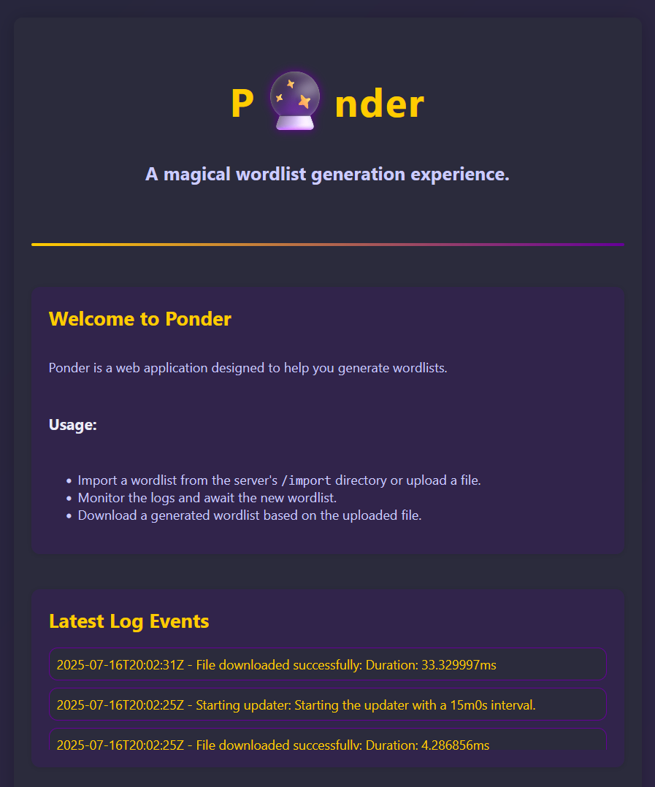

# Ponder
Ponder is a lightweight web application that allows for the generation of new
wordlists using raw wordlists or found plaintexts. It is designed to be used
as an aggregation tool for wordlists for IoT devices with low
memory availability.

> Version: 0.1.0

## Installation
Clone the repository then enter the directory.
```bash
git clone github.com/hashcracky/ponder . && cd ponder
```

The tool is designed to be used in Docker. To build the image, run the
following command:
```bash
docker build -t ponder .
```

The tool expects a volume to be mounted at `/data`. This can be modified within
the configuration file. This volume is the primary
drive for the tool. To run the tool, use the following command:
```bash
docker run -v ${PWD}:/data -it --rm -p 80:8080 ponder
```

The tool will expose a web interface on port 80. To access the tool, navigate
to the IP/DNS name in your browser.

Several API endpoints are available for use:
- GET `/api/ping`
- GET `/api/event-log`
- GET `/api/download/<number>`
- POST `/api/upload`
- POST `/api/import`

## Usage
The tool is designed to be used as a web application. The primary use case is
uploading files to the tool and waiting for the tool to generate a new
wordlist. The tool will automatically generate a new wordlist when new data is
uploaded and is designed for memory-constrained environments, meaning that it
will primarily use disk space for storage. This application was designed on an
RPI5 with 8 GB of RAM.

The tool can handle:
- `$HEX[]` formatted strings
- Raw strings (not HASH:PLAIN)
- Space separated strings
- `multipart/form-data` uploads

The tool will perform pre-processing and post-processing on the upload to create
a new wordlist. Multiple uploads are aggregated together, and the original format is
saved to preserve future generation cycles. The final sort order is *loosely* frequency
based.

> WARNING: The tool does not currently exhaustively look for duplicates and relies on the operating user.

## Ponder Homepage
<div align="center">
  
</div>
